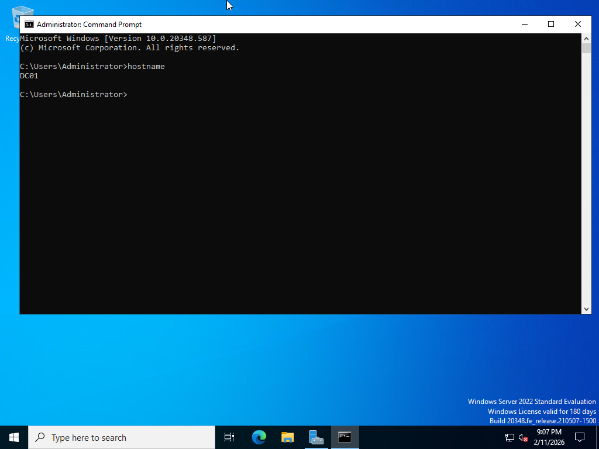
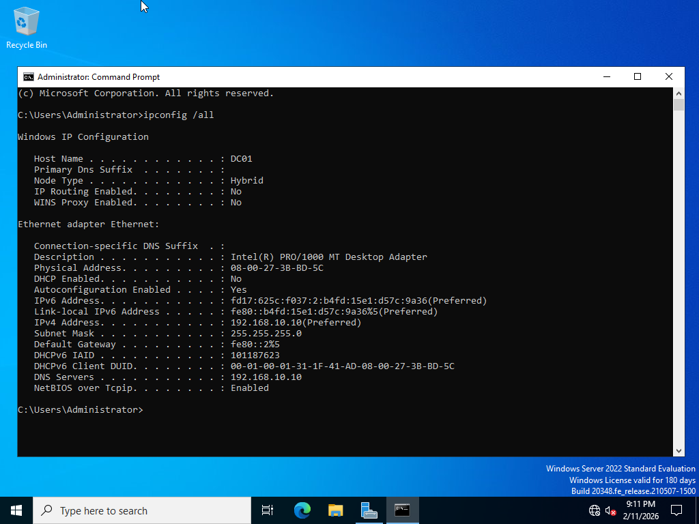
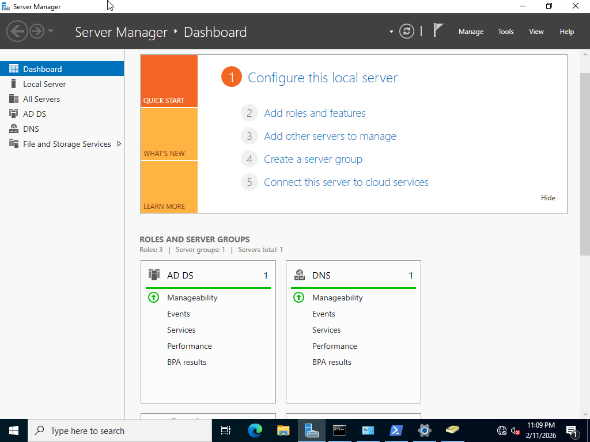
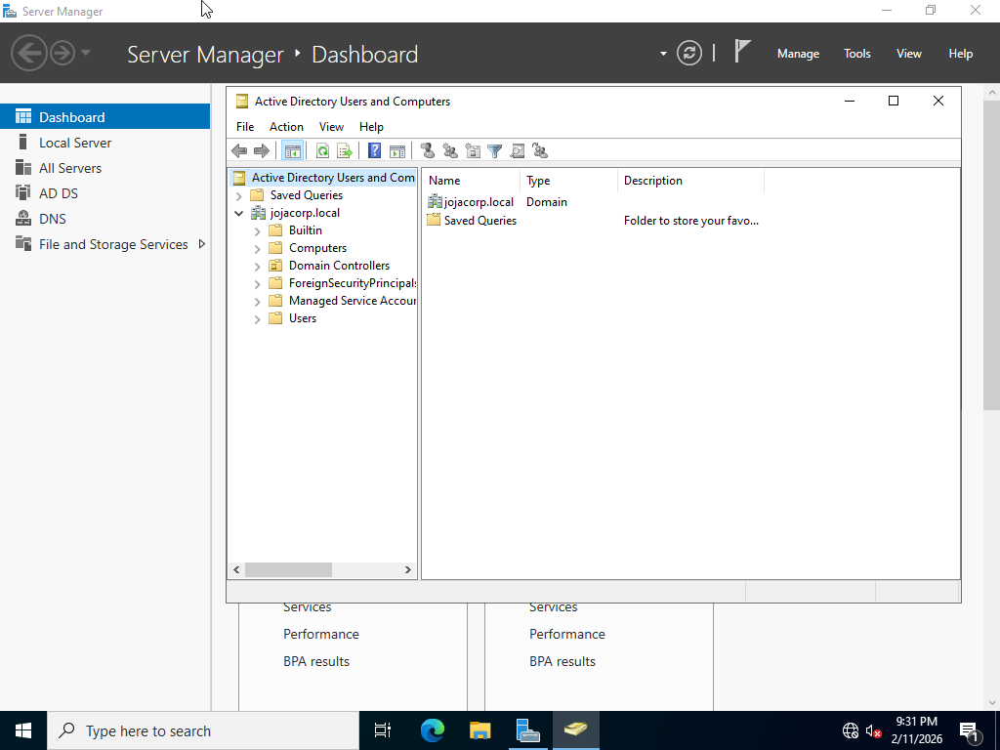
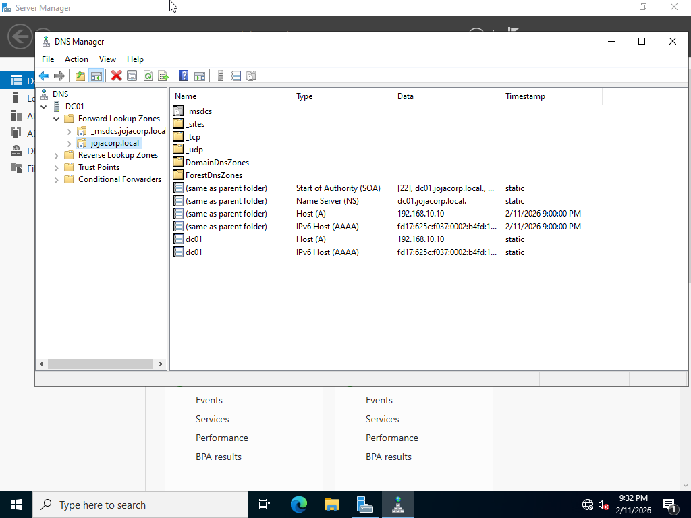
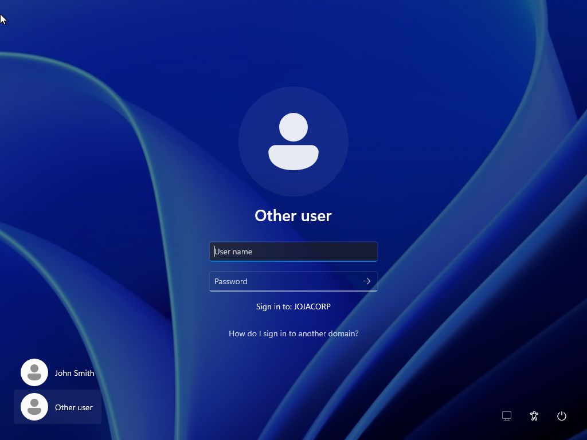

# Environment Setup

## Objective

Build a virtual Active Directory environment with a Domain Controller and a domain-joined client.

## Infrastructure

| Machine | Role              |
| ------- | ----------------- |
| DC01    | Domain Controller |
| PC01    | Domain Client     |

## Configuration

### Domain Controller

* OS: Windows Server 2022
* Hostname: DC01
* Static IP configured
* Active Directory Domain Services installed
* New domain created: **Jojacorp.local**

### Client Machine

* OS: Windows 10/11
* Hostname: PC01
* Joined to the domain: Jojacorp.local

## Verification

* Domain login successful on PC01
* Active Directory Users and Computers accessible
* DNS is functioning correctly

## Screenshots

### Server Renamed

