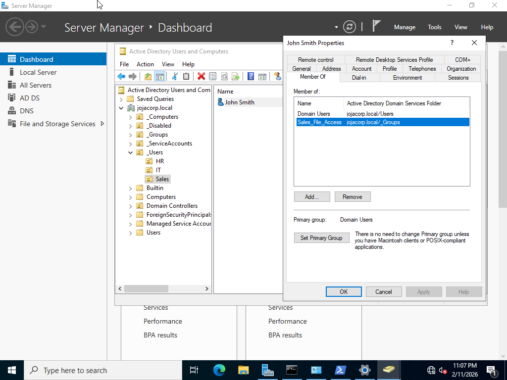
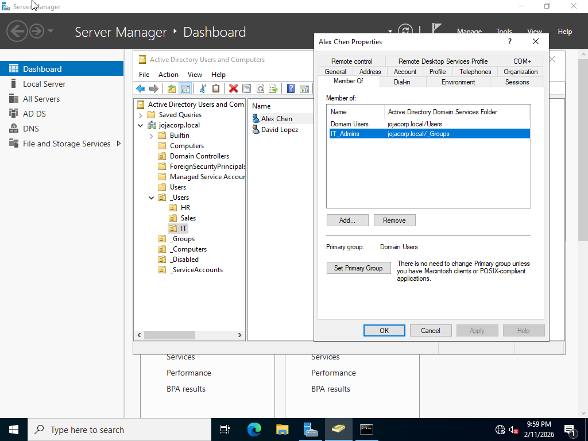
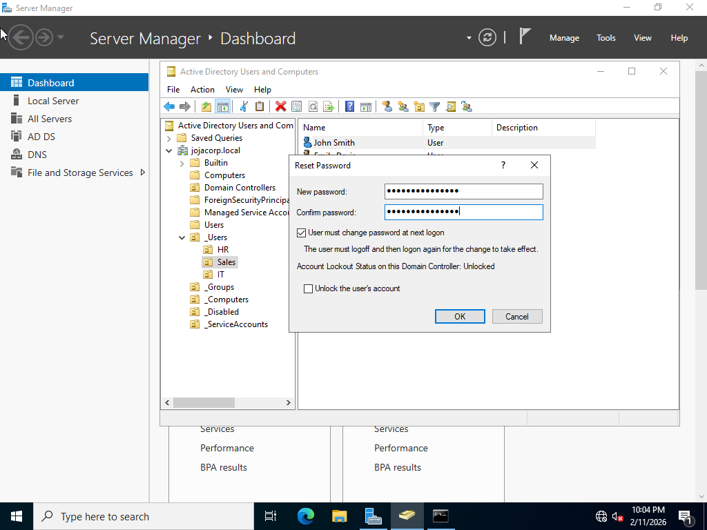
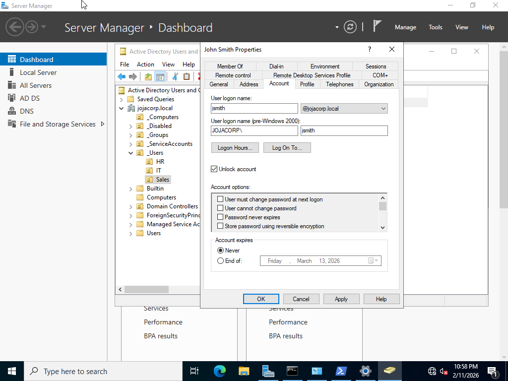
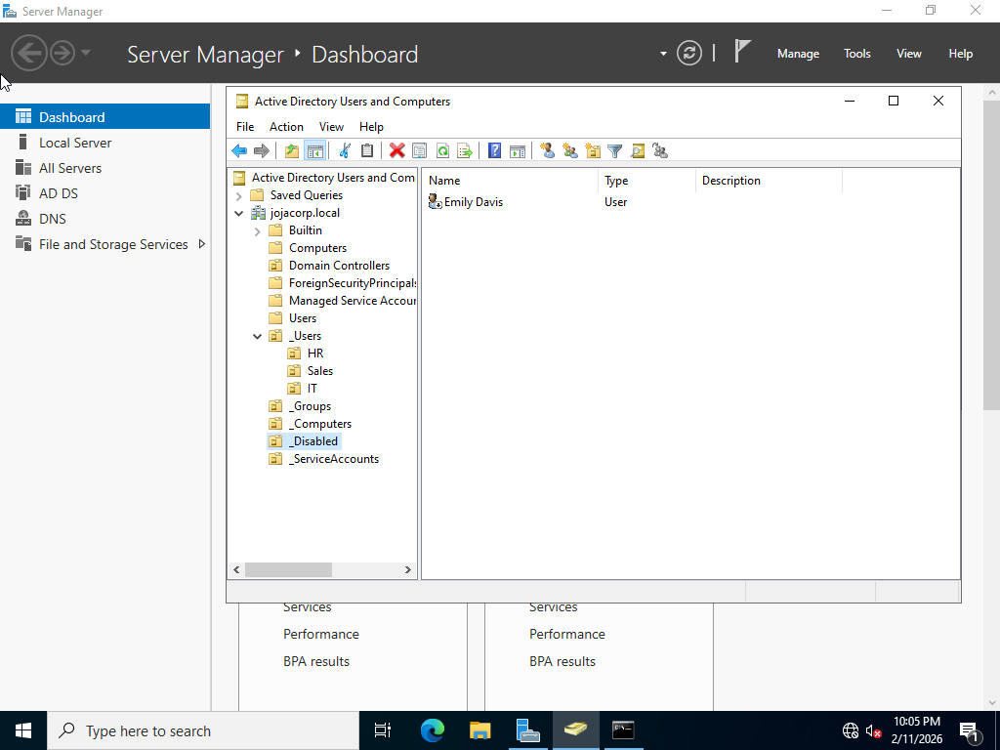
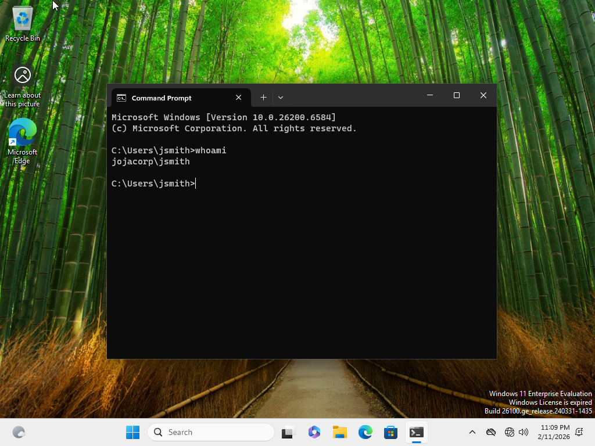

# User Lifecycle Management – JojaCorp

## Objective

Simulate real-world IT Analyst responsibilities by managing the full user lifecycle:

* Account creation (onboarding)
* Group assignment
* Password management
* Account lockout resolution
* Employee offboarding

---

## Business Scenario

JojaCorp hires employees across multiple departments. IT is responsible for:

* Creating accounts
* Assigning appropriate access
* Enforcing security policies
* Handling common Helpdesk requests
* Securely disabling accounts when employees leave

---

## Employee Accounts Created

### HR

* Sarah Parker (sparker)
* Michael Reed (mreed)

### Sales

* John Smith (jsmith)
* Emily Davis (edavis)

### IT

* Alex Chen (achen)
* David Lopez (dlopez)

All accounts were created in their respective departmental OU.

---

## Onboarding Process

For each user:

* Created account in department OU
* Assigned temporary password
* Enabled:

  * **User must change password at next logon**
* Added to the appropriate security group:

| Department | Group             |
| ---------- | ----------------- |
| HR         | HR_File_Access    |
| Sales      | Sales_File_Access |
| IT         | IT_Admins         |

This follows the principle of least privilege using group-based access.

---

## Helpdesk Scenarios Simulated

### 1. Password Reset

User reported inability to sign in.

Action:

* Reset password in ADUC
* Required password change at next logon

---

### 2. Account Lockout Resolution

User account locked due to multiple failed login attempts.

Steps:

* Verified lockout in account properties
* Unlocked account
* Confirmed successful login on the domain workstation

---

### 3. Employee Offboarding

Employee Emily Davis (Sales) left the company.

Steps:

* Disabled account
* Moved user to `_Disabled` OU
* Removed from security groups

This preserves audit history while preventing access.

---

## Verification

* Successful domain login from PC01 using Sales user
* Password change enforced at first login
* Lockout and unlock process validated

---

## Screenshots
### User Creation

### Group Membership Assignment

### Password Reset

### Account Locked

### Account Unlock

### Account Disabled

### User moved to Disabled OU

### Domain Login Verification

---

## Skills Demonstrated

* Active Directory user administration
* Department-based account provisioning
* Group-based access assignment
* Helpdesk troubleshooting workflows
* Account security and offboarding procedures
* Identity lifecycle management
