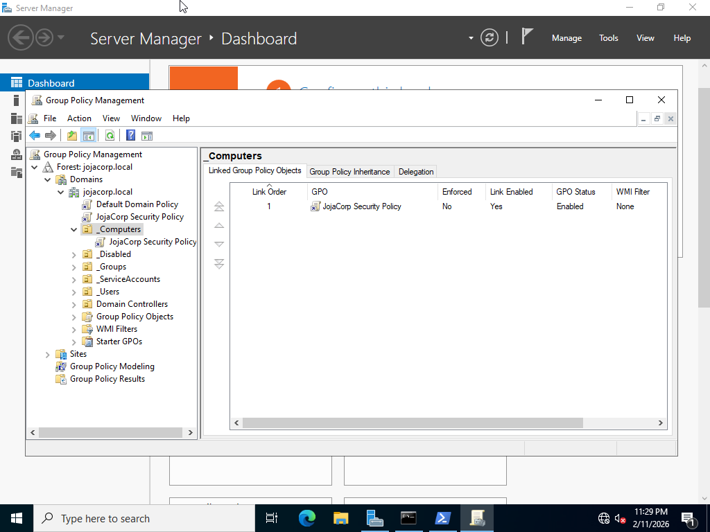
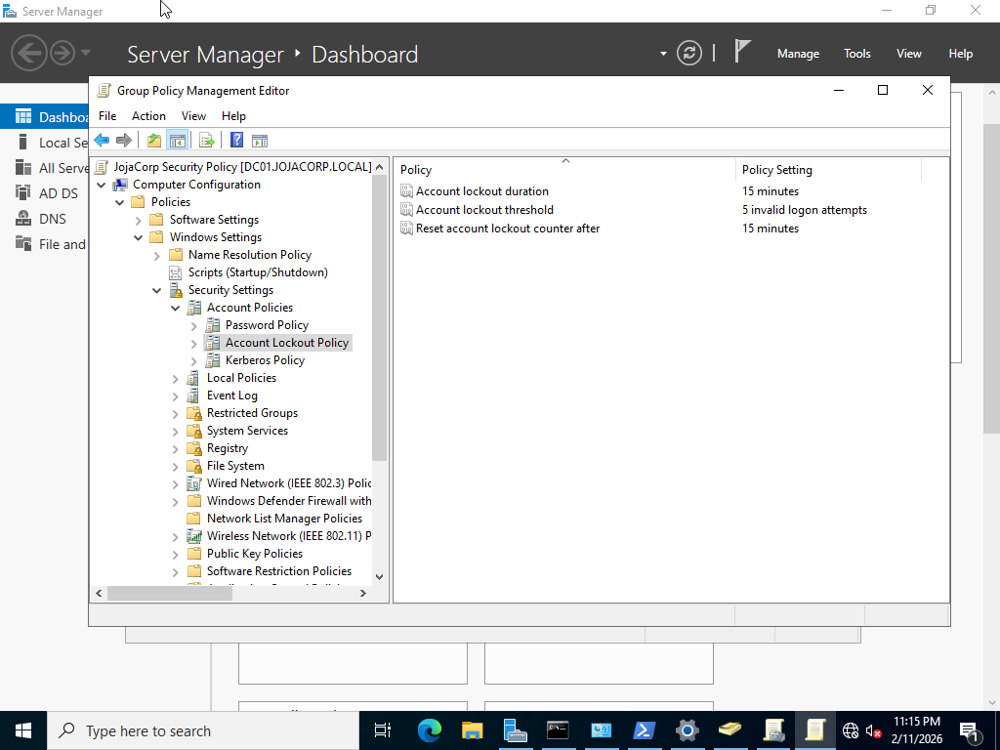
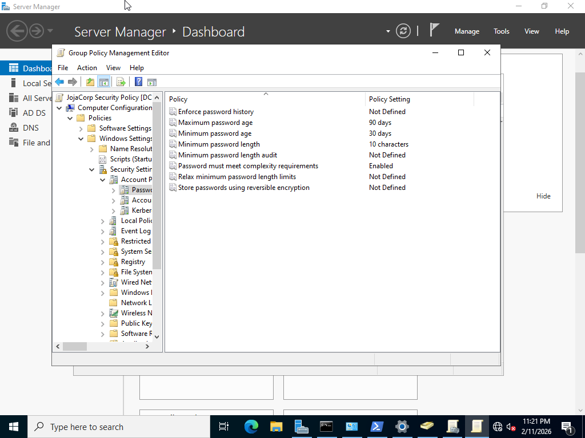
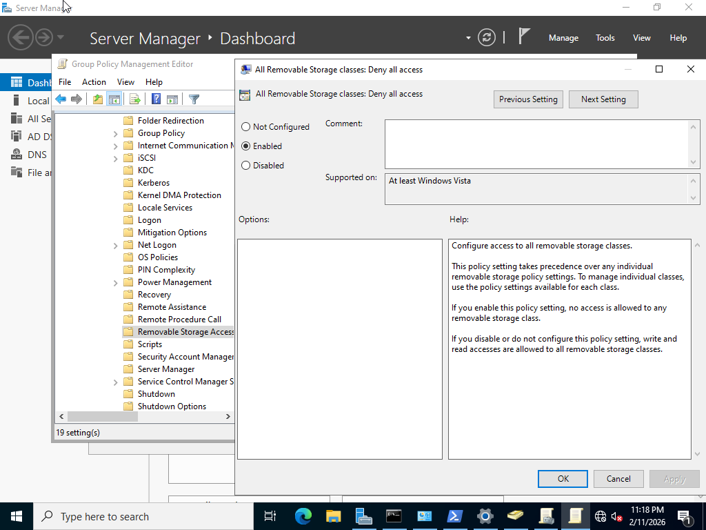
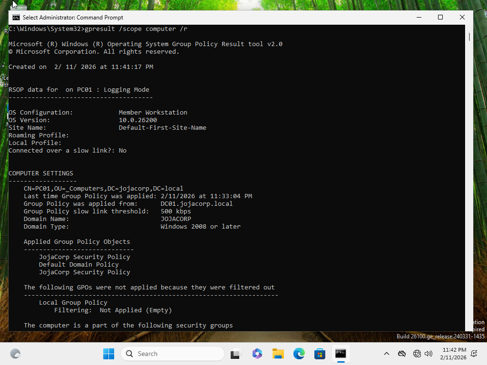

# Group Policy Implementation – JojaCorp

## Objective

Implement centralized security controls using Group Policy to enforce account protection, password standards, and endpoint restrictions across domain-joined systems.

---

## Business Scenario

JojaCorp requires domain-level security policies to:

- Protect against brute-force login attempts  
- Enforce strong password requirements  
- Prevent unauthorized data transfer using removable storage  
- Ensure consistent configuration across all workstations  

These policies were applied to the domain workstation **PC01** using a centralized Group Policy Object (GPO).

---

## GPO Overview

**GPO Name:** JojaCorp Security Policy  
**Scope:** Linked to `_Computers` OU  
**Security Filtering:** Authenticated Users  

This design ensures that all domain-joined workstations placed in the `_Computers` OU automatically receive the policy.

---

## Policies Configured

### Account Lockout Policy

Location: Computer Configuration > Policies > Windows Settings > Security Settings > Account Policies > Account Lockout Policy

Settings:
- Account lockout threshold: **5 invalid attempts**
- Lockout duration: **15 minutes**
- Reset counter after: **15 minutes**

Purpose:
Protect against password brute-force and credential guessing attacks.

---

### Password Policy

Location: Computer Configuration > Policies > Windows Settings > Security Settings > Account Policies > Password Policy 

Settings:
- Minimum password length: **10 characters**
- Password complexity requirements: **Enabled**

Purpose:
Enforce baseline password security standards.

---

### Removable Storage Restrictions

Location: Computer Configuration > Policies > Administrative Templates > System > Removable Storage Access

Setting:
- **All Removable Storage classes: Deny all access**

Purpose:
Prevent unauthorized data exfiltration and reduce malware risk from external devices.

---

## Screenshots

### GPO Linked to Computers OU
#### The JojaCorp Security Policy is linked to the _Computers OU to ensure domain workstations automatically receive computer-level security settings.

### Account Lockout Configuration
#### Account lockout settings configured to protect against brute-force authentication attempts.

### Password Complexity Enforcement
#### Password policy configured to enforce minimum length and complexity requirements for domain accounts.

### USB Storage Restriction
#### Removable storage access is disabled to prevent unauthorized data transfer and reduce malware risk from external devices.

### Policy Applied to Client
#### Group Policy results from PC01 confirming that the JojaCorp Security Policy was successfully applied from the domain controller.

---

## Skills Demonstrated

- Group Policy creation and linking  
- OU-based policy scoping  
- Domain-level security configuration  
- Endpoint policy enforcement  
- Group Policy troubleshooting and validation  
- Centralized Windows administration
