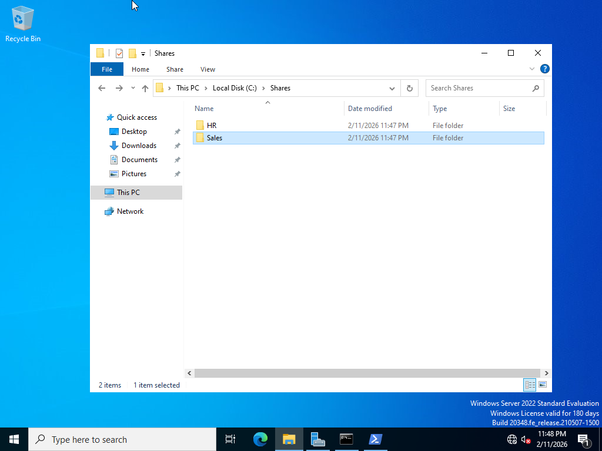
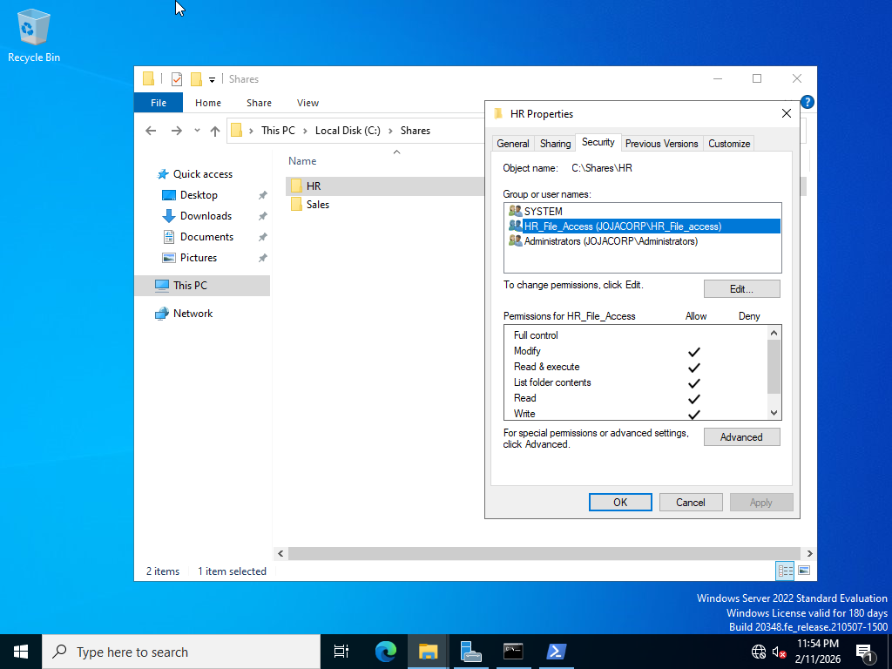
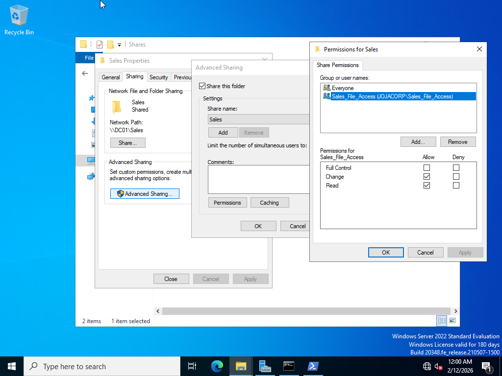
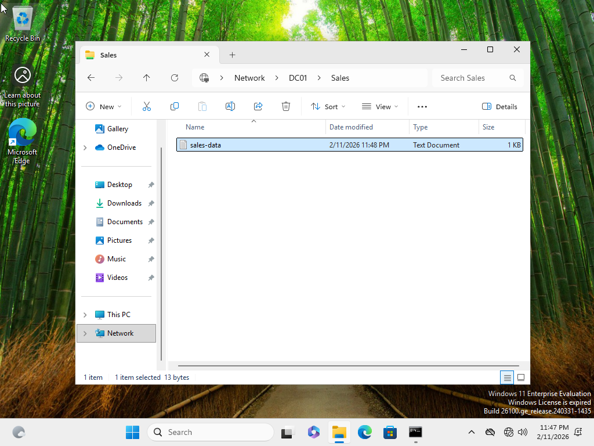
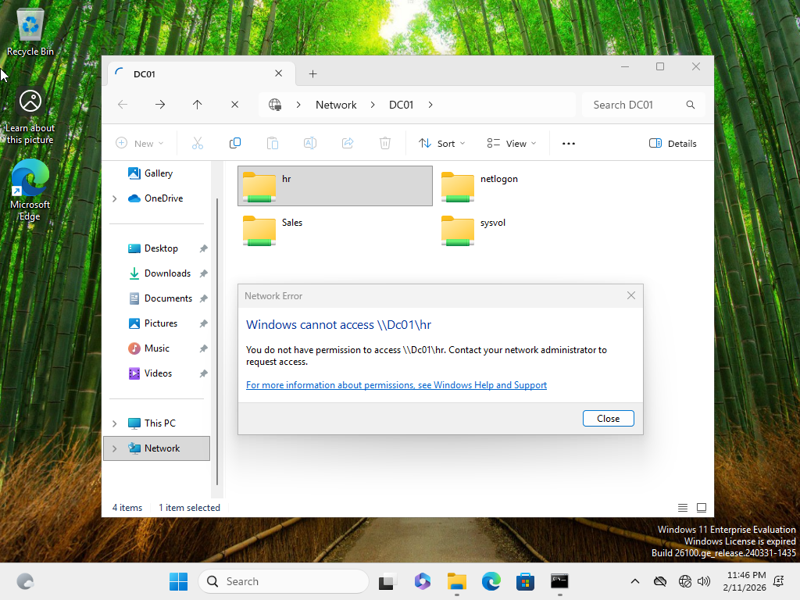

# File Server Configuration – JojaCorp

## Objective

Configure department file shares using group-based access control to ensure users can access only the resources required for their role.

---

## Business Scenario

JojaCorp departments store sensitive operational data on centralized network shares. IT must ensure:

- Departmental data separation  
- Least-privilege access  
- Group-based permission management  
- Proper access verification and troubleshooting  

Department shares were created for:

- Human Resources (HR)  
- Sales  

---

## Folder Structure

The following directory structure was created on the domain controller:
C:\Shares
├── HR
└── Sales

Each department folder contains sample data for access testing.

---

## NTFS Permissions

Inheritance was disabled on each department folder to allow explicit permission control.

Permissions were configured as follows:

| Folder | Group | Access |
|--------|------|--------|
| HR | HR_File_Access | Modify |
| Sales | Sales_File_Access | Modify |

Default **Users** access was removed to enforce least privilege.

---

## Share Permissions

Each folder was shared using Advanced Sharing.

| Share Name | Group | Access |
|------------|------|--------|
| HR | HR_File_Access | Change, Read |
| Sales | Sales_File_Access | Change, Read |

Access is controlled through security groups rather than individual users.

---

## Access Testing

Testing was performed from the domain workstation **PC01**.

### Sales User Test (jsmith)

**Expected Results**

| Resource | Result |
|---------|--------|
| \\DC01\Sales | Access granted |
| \\DC01\HR | Access denied |

Results confirmed proper department-level access control.

---

## Screenshots

### Folder Structure
#### Department share directories created to separate HR and Sales data within the centralized file storage location.

### NTFS Permissions – HR
#### Inheritance disabled and explicit NTFS permissions configured to allow access only to the HR_File_Access security group.

### Share Permissions
#### Network share configured using Advanced Sharing with access restricted to department security groups.

### Sales Access Successful
#### Sales user (jsmith) successfully accessed the Sales share from the domain workstation PC01, confirming correct group-based permissions.

### HR Access Denied
#### Sales user (jsmith) denied access to the HR share, verifying enforcement of least-privilege and department-level isolation.

### Sales Access Successful
#### Sales user (jsmith) granted access to the Sales share

---

## Skills Demonstrated

- NTFS permission configuration  
- Share permission management  
- Inheritance control and explicit permissions  
- Role-based access control (RBAC)  
- Least-privilege implementation  
- Access validation and troubleshooting  
- Windows file server administration
