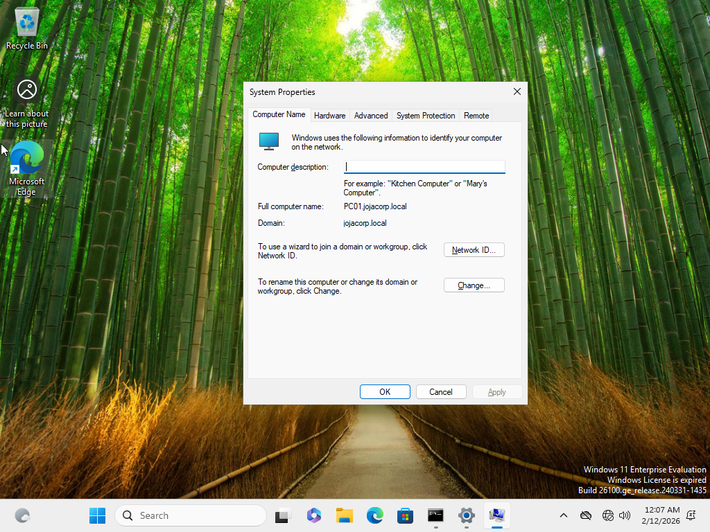
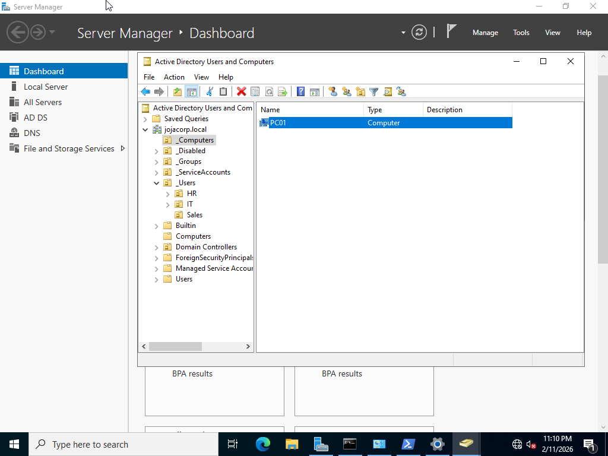

# Domain Join – JojaCorp

## Objective

Deploy a workstation to the Active Directory domain and verify successful domain authentication and computer object management.

---

## Business Scenario

New employee workstations must be joined to the domain to enable:

- Centralized authentication  
- Group Policy enforcement  
- Network resource access  
- Administrative management  

Workstation **PC01** was configured and joined to the **jojacorp.local** domain.

---

## Configuration Steps

- Configured DNS on PC01 to point to domain controller (DC01)
- Joined workstation to domain: `jojacorp.local`
- Restarted the system to complete domain membership
- Verified domain login using Sales user account
- Confirmed computer object placement in `_Computers` OU

---

## Verification

Domain functionality confirmed through:

- Successful login using domain credentials  
- Computer object visible in Active Directory  
- Group Policy successfully applied  
- Network resource access available  

---

## Screenshots

### Workstation Joined to Domain

PC01 successfully joined the Active Directory domain.

---

### Domain User Login

Successful authentication using the domain account on PC01.

---

### Computer Object in OU

PC01 computer account located in the `_Computers` organizational unit.

---

### Domain Identity Verification

Command output confirming domain user context.

---

## Skills Demonstrated

- Domain workstation deployment  
- DNS configuration for domain services  
- Active Directory computer management  
- Domain authentication verification  
- Endpoint integration with the enterprise environment
