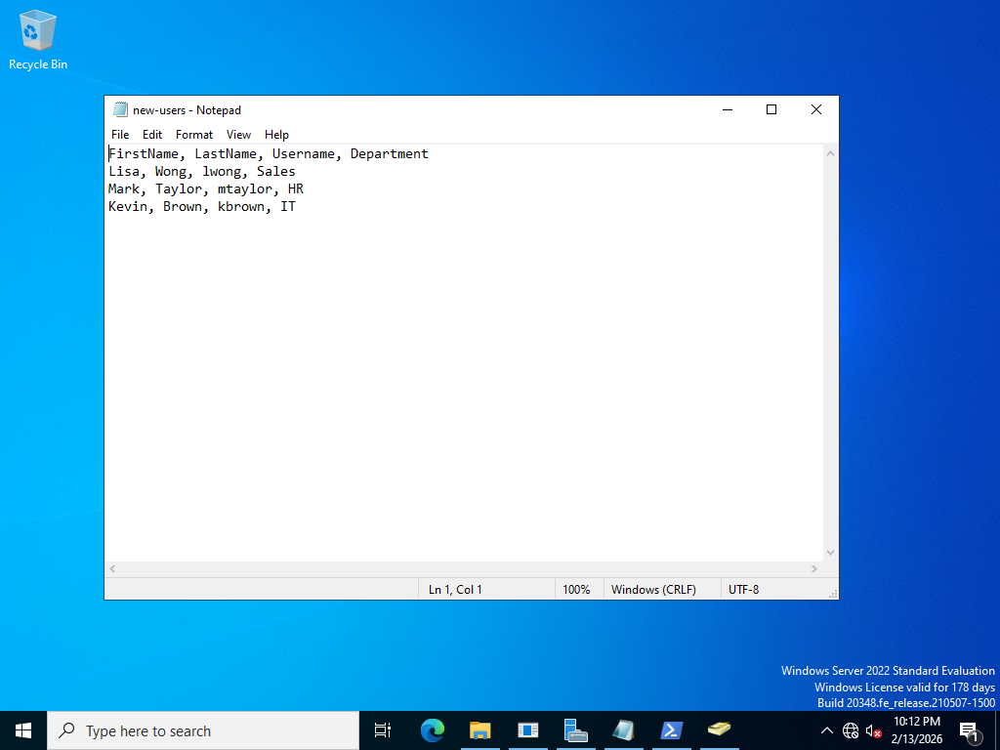
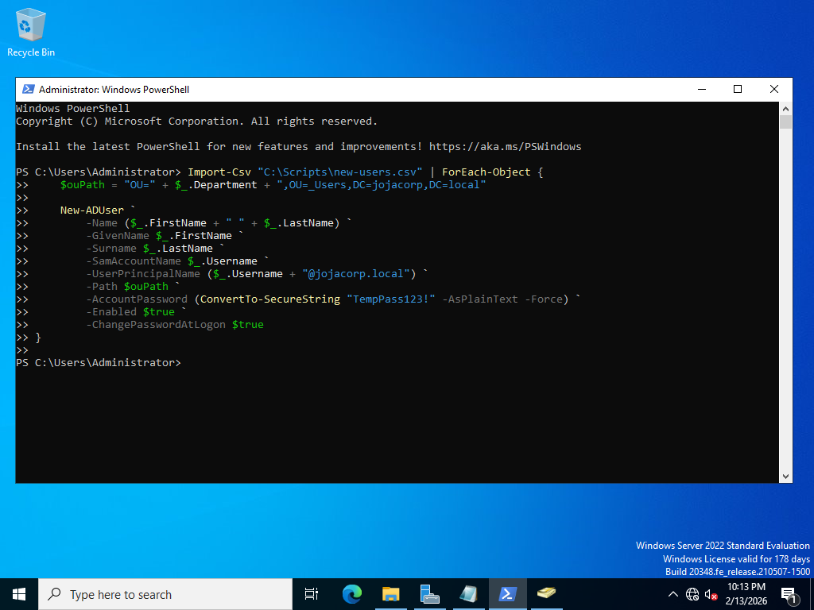
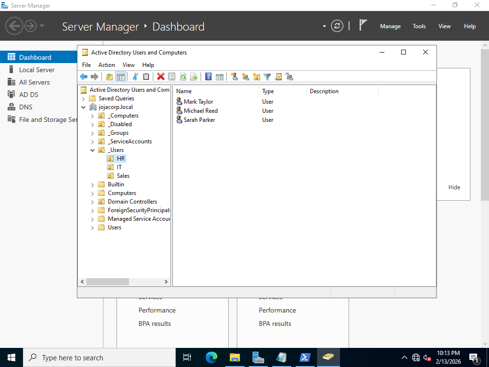

# PowerShell Automation – JojaCorp

## Objective

Automate user account provisioning using PowerShell to reduce manual administrative effort and improve consistency.

---

## Business Scenario

JojaCorp regularly hires new employees across multiple departments. Manual account creation is time-consuming and prone to errors.

PowerShell automation was implemented to:

- Create multiple user accounts from a CSV file  
- Automatically place users in the correct department OU  
- Set initial passwords and security settings  

---

## CSV Input

User data was stored in a structured CSV file containing:

- First Name  
- Last Name  
- Username  
- Department  

The department value was used to dynamically determine the OU path.

---

## Automation Process

The script:

- Imported user data using `Import-Csv`
- Built OU paths based on department
- Created accounts using `New-ADUser`
- Set temporary password
- Enabled accounts
- Required password change at first login

---

## Verification

New users were confirmed in Active Directory within their respective departmental OUs.

---

## Screenshots

### CSV Input File
#### User account information stored in a structured CSV file used as the data source for automated account creation.

---

### PowerShell Execution
#### PowerShell script executed on the domain controller to import CSV data and create multiple user accounts automatically.

---

### Users Created in Active Directory
#### New user accounts successfully created and placed in their respective departmental Organizational Units.

---

## Skills Demonstrated

- PowerShell scripting for Active Directory  
- Bulk user provisioning  
- CSV data handling  
- Automation of administrative tasks  
- OU-based account placement  
- IT process efficiency improvement
